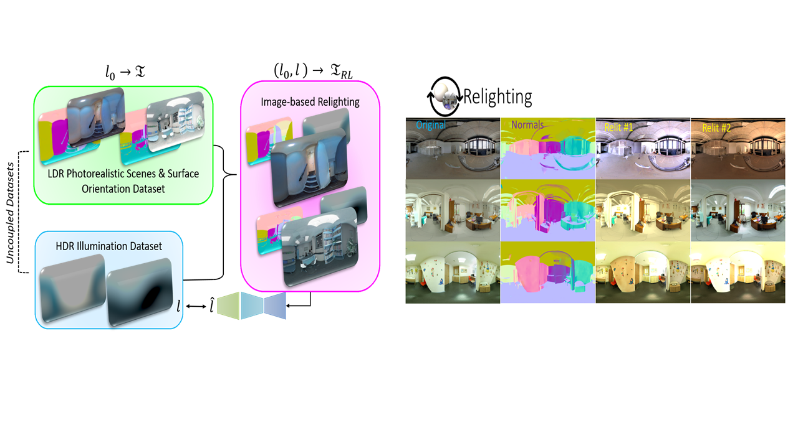
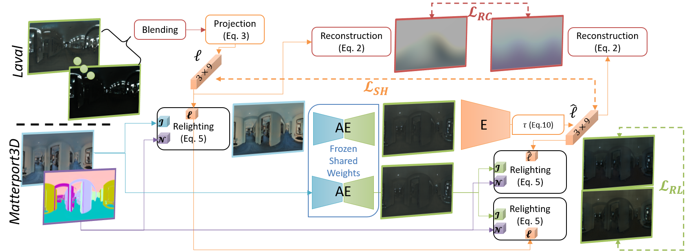
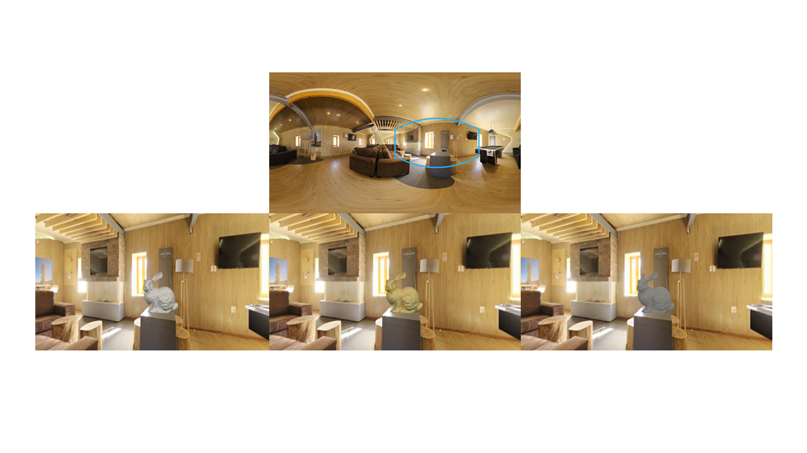
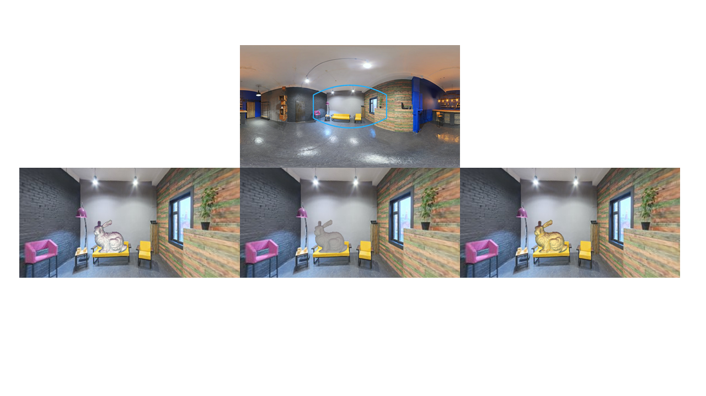

# Abstract

Estimating a scene’s lighting is a very important task when compositing synthetic content within real environments, with applications in  mixed reality and post-production.
In this work we present a data-driven model that estimates an HDR lighting environment map from a single LDR monocular spherical panorama.
In addition to being a challenging and ill-posed problem, the lighting estimation task also suffers from a lack of facile illumination ground truth data,  a fact that hinders the applicability of data-driven methods.
We approach this problem differently, exploiting  the  availability  of  surface  geometry  to  employ image-based relighting as a data generator and supervision mechanism.
This relies on a global Lambertian assumption that helps us overcome issues related to pre-baked lighting.
We relight our training data and complement the model’s supervision with a photometric loss, enabled by a differentiable image-based relighting technique.
Finally, since we predict spherical spectral coefficients, we show that by imposing a distribution prior on the predicted coefficients, we can greatly boost performance

___

# Overview
We use the uncoupled limited Laval HDR lighting dataset (__\[[1](#Laval)\]__) and the larger [3D60](https://vcl3d.github.io/3D60) color and normal dataset (__\[[2](#HyperSphere)\]__) jointly, coupling them through relighting in order to learn a single-shot HDR lighting estimator from a single LDR spherical panorama. 



# Relighting-based Supervision



# Results
 


# Publication
<a href="https://arxiv.org/"></a>

## Authors
[Vasilis Gkitsas](https://github.com/VasilisGks) __\*__, [Nikolaos](https://github.com/zokin) [Zioulis](https://github.com/zuru) __\*__, [Federico Alvarez](https://www.researchgate.net/profile/Federico_Alvarez3), [Dimitrios Zarpalas](https://www.iti.gr/iti/people/Dimitrios_Zarpalas.html), and [Petros Daras](https://www.iti.gr/iti/people/Petros_Daras.html)

## Citation
If you use this code and/or data, please cite the following:
```
@inproceedings{gkitsas2019deeplighting,
  author       = "Gkitsas, Vasileios and Zioulis, Nikolaos and Alvarez, Federic and Zarpalas, Dimitris and Daras, Petros",
  title        = "Deep Lighting Environment Map Estimation from Spherical Panoramas",
  booktitle    = "2020 Conference on Computer Vision and Pattern Recognition (CVPR)",
  month        = "June",
  year         = "2020"
}
```


# Acknowledgements
This project has received funding from the European Union’s Horizon 2020 innovation programme [Hyper360](https://hyper360.eu/) under grant agreement No 761934.

 We would like to thank NVIDIA for supporting our research with GPU donations through the NVIDIA GPU Grant Program.

{:width="150px"} {:width="150px"} {:width="150px"}

# Contact
Please direct any questions related to the code & models to gkitsasv “at” iti “dot” gr or post an issue to the code [repo](https://github.com/VCL3D/DeepPanoramaLighting).

# References
<a name="Laval"/>__\[1\]__ Gardner, M. A., Sunkavalli, K., Yumer, E., Shen, X., Gambaretto, E., Gagné, C., & Lalonde, J. F. (2017). [Learning to predict indoor illumination from a single image.](https://arxiv.org/pdf/1704.00090.pdf) ACM Transactions on Graphics (TOG), 36(6), 1-14.

<a name="HyperSphere"/>__\[[2](https://vcl3d.github.io/HyperSphereSurfaceRegression/)\]__ Karakottas, A., Zioulis, N., Samaras, S., Ataloglou, D., Gkitsas, V., Zarpalas, D., and Daras, P. (2019). [360<sup>o</sup> Surface Regression with a Hyper-sphere Loss](https://arxiv.org/pdf/1909.07043.pdf). In Proceedings of the International Conference on 3D Vision (3DV).

