# Abstract

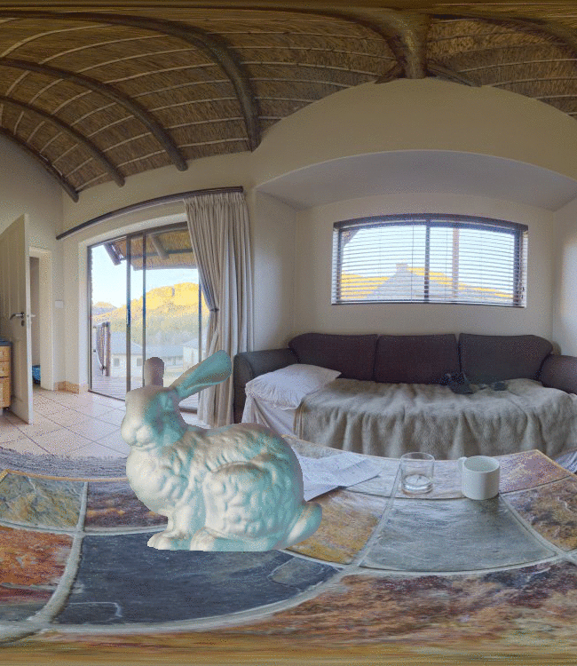

Estimating a scene’s lighting is a very important task when compositing synthetic content within real environments, with applications in  mixed reality and post-production.
In this work we present a data-driven model that estimates an HDR lighting environment map from a single LDR monocular spherical panorama.
In addition to being a challenging and ill-posed problem, the lighting estimation task also suffers from a lack of facile illumination ground truth data,  a fact that hinders the applicability of data-driven methods.
We approach this problem differently, exploiting  the  availability  of  surface  geometry  to  **employ image-based relighting as a data generator and supervision mechanism**.
This relies on a global Lambertian assumption that helps us overcome issues related to pre-baked lighting.
We relight our training data and complement the model’s supervision with a photometric loss, enabled by a **differentiable image-based relighting technique**.
Finally, since we predict spherical spectral coefficients, we show that by imposing a **distribution prior on the predicted coefficients**, we can greatly boost performance

<p align="center">
<iframe width="720" height="480" src="https://www.youtube.com/embed/M7c69qxVzXY" frameborder="0" allow="accelerometer; autoplay; encrypted-media; gyroscope; picture-in-picture" allowfullscreen></iframe>
</p>
___

# Overview
We use the uncoupled limited Laval HDR lighting dataset (\[[1](#Laval)\]) and the larger [3D60](https://vcl3d.github.io/3D60) color and normal dataset (\[[2](#HyperSphere)\]) jointly, coupling them through relighting in order to learn a single-shot HDR lighting estimator from a single LDR spherical panorama. 

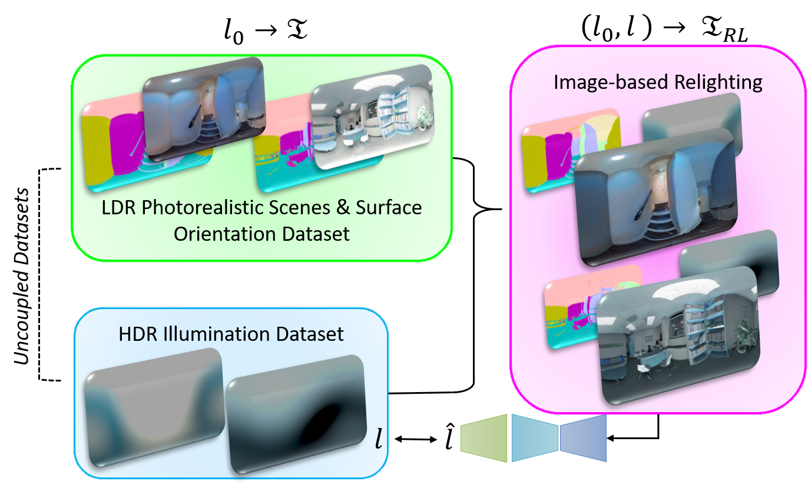

# Relighting-based Supervision


# Results
Qualitative results for virtual object rendering in real scenes with the lighting estimated by our model.

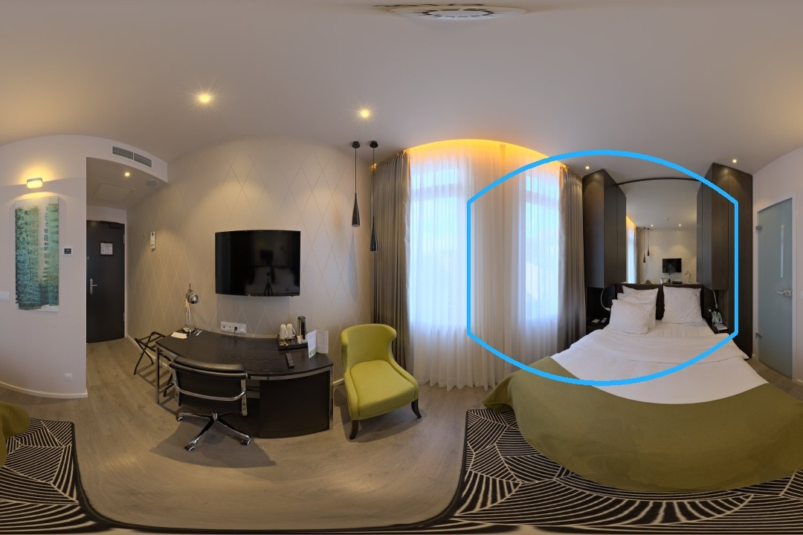
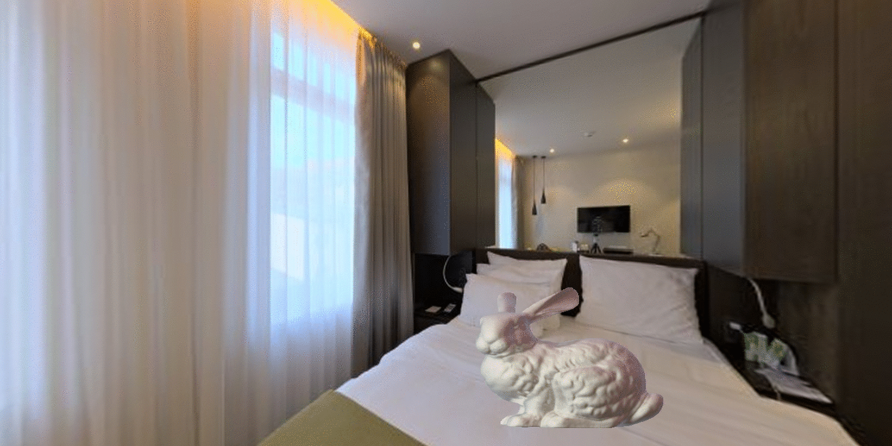

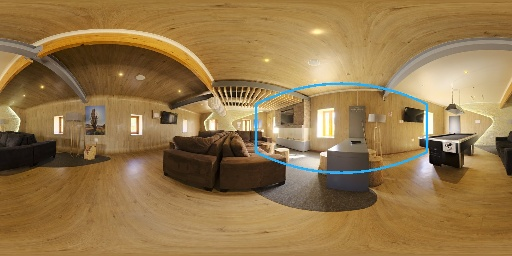
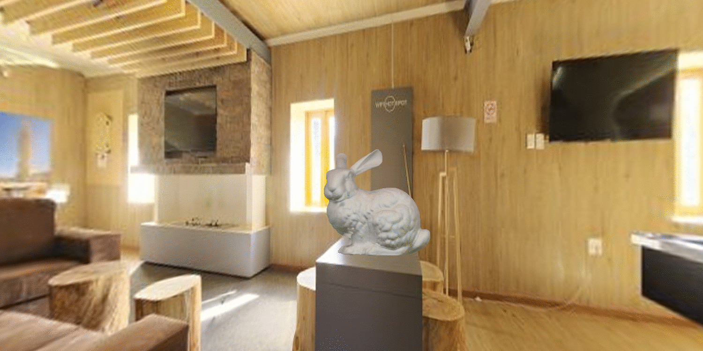

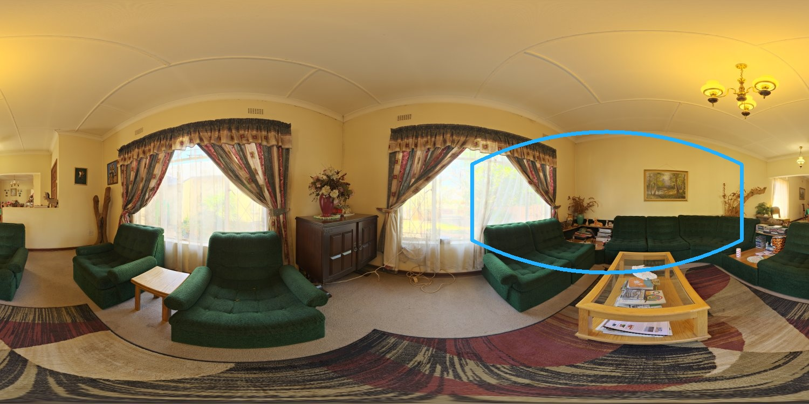
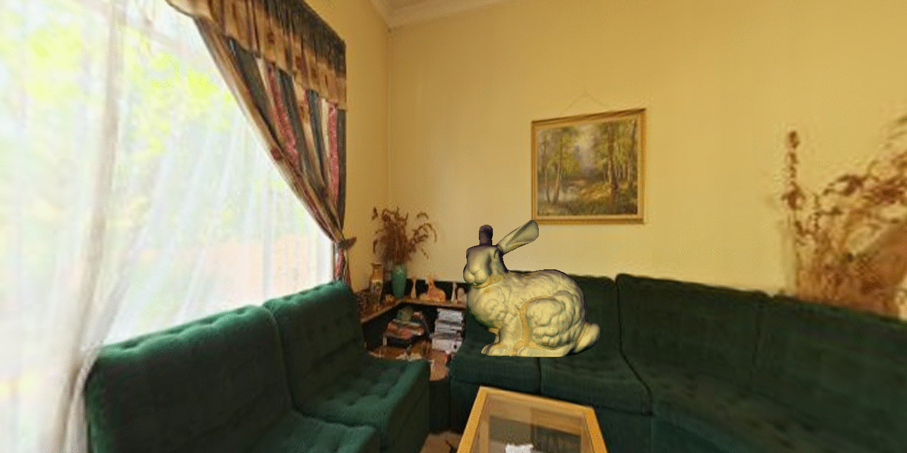
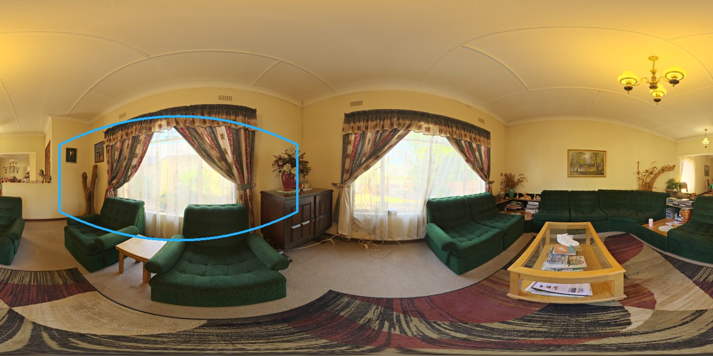
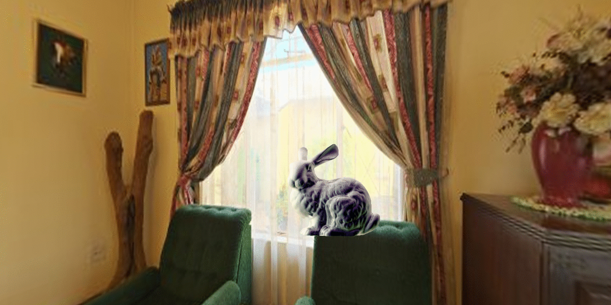


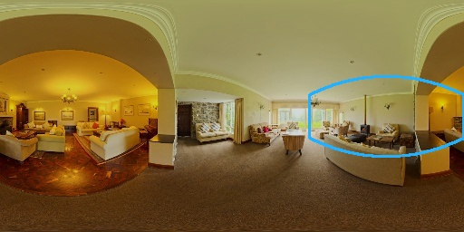
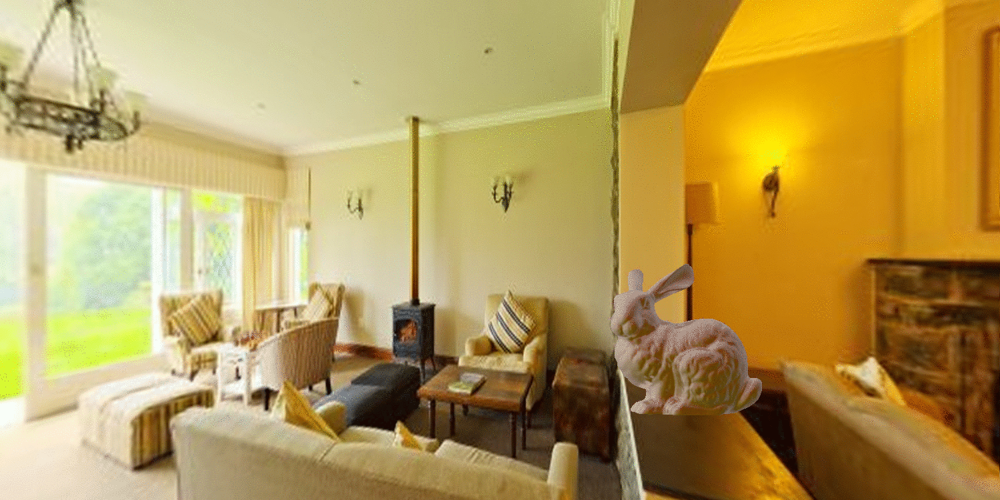

<!--


 


-->

> Images are in-the-wild samples from [HDRiHaven](https://hdrihaven.com/). Three materials are used: a conductor(reflecting mirror), rough plastic and another conductor(gold). On each row, the leftmost image is the panorama, while the rightmost show perspective render (viewport denoted within the panorama). 

# Publication
<a href="https://arxiv.org/abs/2005.08000">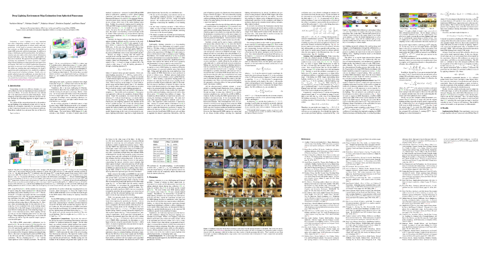</a>

## Authors
[Vasilis Gkitsas](https://github.com/VasilisGks) __\*__, [Nikolaos](https://github.com/zokin) [Zioulis](https://github.com/zuru) __\*__, [Federico Alvarez](https://www.researchgate.net/profile/Federico_Alvarez3), [Dimitrios Zarpalas](https://www.iti.gr/iti/people/Dimitrios_Zarpalas.html), and [Petros Daras](https://www.iti.gr/iti/people/Petros_Daras.html)

## Citation
If you use this code and/or data, please cite the following:
```
@inproceedings{gkitsas2020deep,
  title={Deep lighting environment map estimation from spherical panoramas},
  author={Gkitsas, Vasileios and Zioulis, Nikolaos and Alvarez, Federico and Zarpalas, Dimitrios and Daras, Petros},
  booktitle={Proceedings of the IEEE/CVF Conference on Computer Vision and Pattern Recognition Workshops},
  pages={640--641},
  year={2020}
}
```


# Acknowledgements
This project has received funding from the European Union’s Horizon 2020 innovation programme [Hyper360](https://hyper360.eu/) under grant agreement No 761934.

 We would like to thank NVIDIA for supporting our research with GPU donations through the NVIDIA GPU Grant Program.

{:width="150px"} {:width="150px"} {:width="150px"}

# Contact
Please direct any questions related to the code & models to gkitsasv “at” iti “dot” gr or post an issue to the code [repo](https://github.com/VCL3D/DeepPanoramaLighting).

# References
<a name="Laval"/>__\[1\]__ Gardner, M. A., Sunkavalli, K., Yumer, E., Shen, X., Gambaretto, E., Gagné, C., & Lalonde, J. F. (2017). [Learning to predict indoor illumination from a single image.](https://arxiv.org/pdf/1704.00090.pdf) ACM Transactions on Graphics (TOG), 36(6), 1-14.

<a name="HyperSphere"/>__\[[2](https://vcl3d.github.io/HyperSphereSurfaceRegression/)\]__ Karakottas, A., Zioulis, N., Samaras, S., Ataloglou, D., Gkitsas, V., Zarpalas, D., and Daras, P. (2019). [360<sup>o</sup> Surface Regression with a Hyper-sphere Loss](https://arxiv.org/pdf/1909.07043.pdf). In Proceedings of the International Conference on 3D Vision (3DV).

